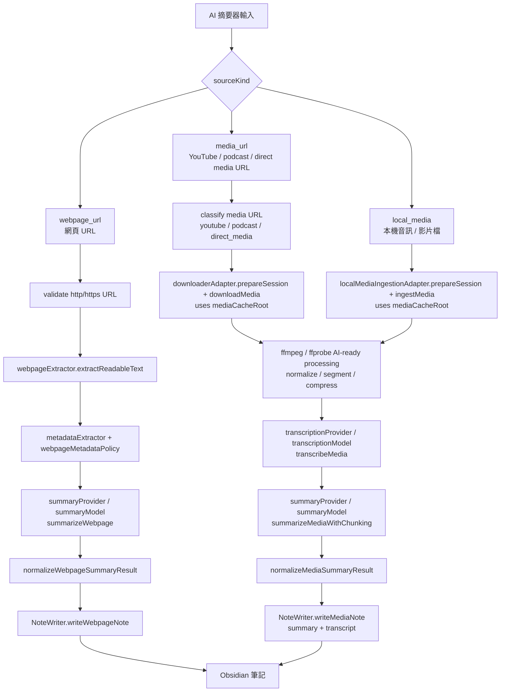

# Architecture Boundary

## 專案目標

本專案要把既有 `AI Summarizer` 桌面 Python app，重構為可在 Obsidian 中運作的 plugin。

架構設計有兩個固定前提：

1. 產品行為要盡量對等保留。
2. runtime 實作方式必須可替換。

## 目標模組分層

```text
src/
  plugin/
    AISummarizerPlugin.ts
    commands.ts
    lifecycle.ts
  ui/
    settings-tab.ts
    flow-modal/
    notices/
  domain/
    types.ts
    jobs.ts
    settings.ts
    prompts.ts
    errors.ts
  orchestration/
    process-webpage.ts
    process-media-url.ts
    process-local-media.ts
    cancellation.ts
    job-runner.ts
  services/
    ai/
    media/
    web/
    obsidian/
  runtime/
    runtime-provider.ts
    runtime-payloads.ts
    runtime-factory.ts
    local-bridge-runtime.ts
    placeholder-runtime.ts
  utils/
    filenames.ts
    dates.ts
    markdown.ts
    logging.ts
```

## 依賴方向

固定依賴方向如下：

1. `plugin -> ui / orchestration / domain`
2. `ui -> domain / orchestration view models`
3. `orchestration -> domain / services / runtime`
4. `services -> domain / utils`
5. `runtime -> domain / utils`
6. `domain` 不依賴 Obsidian、React、runtime 細節

## 各層責任

- `plugin/`
  - Obsidian lifecycle
  - commands / ribbon / registration
  - settings persistence wiring
- `ui/`
  - modal、settings tab、progress、result feedback
  - 不直接碰 runtime adapter
- `domain/`
  - source request types
  - metadata / transcript / summary / note input types
  - settings contract
  - job state 與 error categories
- `orchestration/`
  - use case 組裝
  - stage transition
  - cancellation handling
  - 把 runtime、AI、note writer 串成完整流程
- `services/`
  - AI provider
  - webpage extractor
  - note writer / template resolver / path resolver
  - media/subtitle adapter
- `runtime/`
  - 處理 runtime-dependent 能力
  - v1 media strategy 採 `local_bridge`，但保留 `placeholder_only` fallback
  - 仍不得讓 runtime 細節滲入 domain / note writer
- `utils/`
  - 純工具函式，不承載產品流程

## AI 工作流程

### 簡化版

```text
輸入資料
-> 依來源做前處理
-> AI 轉錄 / 摘要
-> 寫入 Obsidian 筆記
```

來源分支：

```text
webpage_url
-> 抽取網頁文字與 metadata
-> AI 摘要
-> 寫入 Obsidian
```

```text
media_url / local_media
-> 下載或匯入媒體
-> 轉成 AI-ready media artifact
-> AI 轉錄
-> AI 摘要
-> 寫入 Obsidian
```

### 詳細流程

三種輸入來源共用同一個 flow modal 入口，但進入 AI 前的 acquisition / extraction pipeline 不同。模型路徑分成兩類：

1. `webpage_url`：只走摘要模型，不走轉錄模型。
2. `media_url` / `local_media`：先走轉錄模型，再走摘要模型。



### 模型路由規則

- 網頁來源不使用 `transcriptionProvider` / `transcriptionModel`；即使已設定轉錄 provider / model，網頁也只會交給 `summaryProvider` / `summaryModel`。
- `media_url` 與 `local_media` 進入 AI 後共用同一條模型路徑：`transcriptionProvider / transcriptionModel -> summaryProvider / summaryModel`。
- YouTube、podcast、direct media URL 的差異只在 URL 分類、下載器與 metadata；轉成 AI-ready media artifact 後，後段與本機媒體一致。
- `summaryProvider = openrouter` 時，OpenRouter 只負責文字摘要；不負責直接讀取音訊或影片。
- Flow modal 應接 production service wiring：webpage extraction 使用 `FetchWebpageExtractor`，摘要使用 configured Gemini/OpenRouter summary provider，媒體轉錄使用 configured transcription provider（目前實作為 Gemini），筆記輸出使用 `ObsidianNoteWriter`。測試中仍可用 mock dependency 驗證 orchestration contract。

## 關鍵契約

### RuntimeProvider

所有與執行環境耦合的處理都必須走 runtime 邊界。

```ts
interface RuntimeProvider {
  strategy: RuntimeStrategy;
  processMediaUrl(input: MediaUrlRequest, signal: AbortSignal): Promise<MediaProcessResult>;
  processLocalMedia(input: LocalMediaRequest, signal: AbortSignal): Promise<MediaProcessResult>;
  processWebpage(input: WebpageRequest, signal: AbortSignal): Promise<WebpageProcessResult>;
}
```

### AiProvider

```ts
interface AiProvider {
  summarizeMedia(input: MediaAiInput, signal: AbortSignal): Promise<MediaSummaryResult>;
  summarizeWebpage(input: WebpageAiInput, signal: AbortSignal): Promise<WebpageSummaryResult>;
}
```

### NoteWriter

```ts
interface NoteWriter {
  writeMediaNote(input: MediaNoteInput): Promise<WriteResult>;
  writeWebpageNote(input: WebpageNoteInput): Promise<WriteResult>;
}
```

## 狀態邊界

- durable state
  - plugin settings
  - template reference
  - output folder
  - retention mode
- volatile flow state
  - 使用者本次輸入
  - validation errors
  - current step
- job state
  - `idle`
  - `validating`
  - `acquiring`
  - `transcribing`
  - `summarizing`
  - `writing`
  - `completed`
  - `failed`
  - `cancelled`

## 高風險區

以下區域必須視為高風險：

1. prompt contract
2. note output contract
3. path collision handling
4. cancellation flow
5. retention policy
6. runtime payload contract

## 不可做的事

1. 不要把 orchestration 塞進 `main.ts` 或 React component。
2. 不要讓 UI 直接操作 file writing 或 runtime。
3. 不要讓 runtime 實作滲入 note writer 與 domain。
4. 不要把字幕能力變成主流程硬依賴。
5. 不要在尚未定案前把媒體處理寫死為單一本機方案。

## 第一版實作優先序

1. `webpage flow`（已完成）
2. `settings + note writer + prompt assets`（已完成）
3. `runtime strategy boundary`（`local_bridge` + `placeholder_only` fallback，已完成）
4. `media URL flow`（進行中：先完成 dependency readiness + cache resolution）
5. `local media flow`（待開始）

